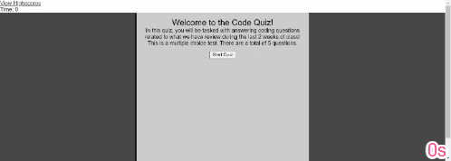

# Code Quiz


## Description
Test your code knowledge! In this App, the User is prompted to start a quiz to test their knowledge of basic coding concepts. Click 'Start Quiz' to see how much you know!

## Installation
To clone this to your repository, please use 
```
SSH: git@github.com:d606n6k/code-quiz.git
```
```
HTTPS: https://github.com/d606n6k/code-quiz.git
```
```
GitHub CLI: gh repo clone d606n6k/code-quiz
```

## Usage
Click the 'Start Quiz' button to begin the quiz!


## Credits
Author: William A. Lucht

## License
You may only utilize code written in this repository with full accredidation to the author.